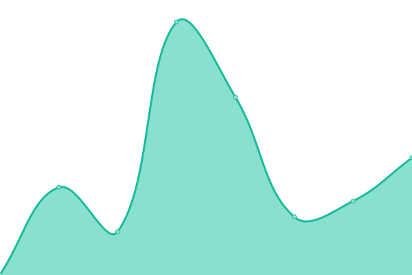

# [📈 Live Status](https://upptime-api.fediverses.kr): <!--live status--> **🟩 All systems operational**

This repository contains the open-source uptime monitor and status page for [fediverses-kr](https://upptime-api.fediverses.kr), powered by [Upptime](https://github.com/upptime/upptime).

With [Upptime](https://upptime.js.org), you can get your own unlimited and free uptime monitor and status page, powered entirely by a GitHub repository. We use [Issues](https://github.com/fediverses-kr/upptime-api/issues) as incident reports, [Actions](https://github.com/fediverses-kr/upptime-api/actions) as uptime monitors, and [Pages](https://upptime-api.fediverses.kr) for the status page.

<!--start: status pages-->
<!-- This summary is generated by Upptime (https://github.com/upptime/upptime) -->
<!-- Do not edit this manually, your changes will be overwritten -->
<!-- prettier-ignore -->
| URL | Status | History | Response Time | Uptime |
| --- | ------ | ------- | ------------- | ------ |
|  [Bluesky (SocialApp XRPC)](https://bsky.social/xrpc/com.atproto.server.describeServer) | 🟩 Up | [bluesky-social-app-xrpc.yml](https://github.com/fediverses-kr/upptime-api/commits/HEAD/history/bluesky-social-app-xrpc.yml) | 

 300ms
     
 | 

<a href="https://upptime-api.fediverses.kr/history/bluesky-social-app-xrpc">100.00%</a>
    

|  Bridgy Fed | 🟩 Up | [bridgy-fed.yml](https://github.com/fediverses-kr/upptime-api/commits/HEAD/history/bridgy-fed.yml) | 

 246ms
     
 | 

<a href="https://upptime-api.fediverses.kr/history/bridgy-fed">100.00%</a>
    

|  [플래닛](https://planet.moe/api/v1/instance/activity) | 🟩 Up | [planet.moe.yml](https://github.com/fediverses-kr/upptime-api/commits/HEAD/history/planet.moe.yml) | 

 786ms
     
 | 

<a href="https://upptime-api.fediverses.kr/history/planet.moe">100.00%</a>
    

|  [큐돈](https://qdon.space/api/v1/instance/activity) | 🟩 Up | [qdon.space.yml](https://github.com/fediverses-kr/upptime-api/commits/HEAD/history/qdon.space.yml) | 

 546ms
     
 | 

<a href="https://upptime-api.fediverses.kr/history/qdon.space">100.00%</a>
    

|  [즘](https://jmm.kr/api/v1/instance/activity) | 🟩 Up | [jmm.kr.yml](https://github.com/fediverses-kr/upptime-api/commits/HEAD/history/jmm.kr.yml) | 

 671ms
     
 | 

<a href="https://upptime-api.fediverses.kr/history/jmm.kr">100.00%</a>
    

|  [유루툿](https://toot.funami.tech/api/v1/instance/activity) | 🟩 Up | [toot.funami.tech.yml](https://github.com/fediverses-kr/upptime-api/commits/HEAD/history/toot.funami.tech.yml) | 

 534ms
     
 | 

<a href="https://upptime-api.fediverses.kr/history/toot.funami.tech">96.81%</a>
    

|  [우리인생](https://uri.life/api/v1/instance/activity) | 🟩 Up | [uri.life.yml](https://github.com/fediverses-kr/upptime-api/commits/HEAD/history/uri.life.yml) | 

 322ms
     
 | 

<a href="https://upptime-api.fediverses.kr/history/uri.life">100.00%</a>
    

|  [마라탕.인생](https://maratang.life/api/v1/instance/activity) | 🟩 Up | [maratang.life.yml](https://github.com/fediverses-kr/upptime-api/commits/HEAD/history/maratang.life.yml) | 

 495ms
     
 | 

<a href="https://upptime-api.fediverses.kr/history/maratang.life">100.00%</a>
    

|  [커리](https://kurry.social/api/v1/instance/activity) | 🟩 Up | [kurry.social.yml](https://github.com/fediverses-kr/upptime-api/commits/HEAD/history/kurry.social.yml) | 

 612ms
     
 | 

<a href="https://upptime-api.fediverses.kr/history/kurry.social">100.00%</a>
    

|  [자커마스](https://occm.cc/api/v1/instance/activity) | 🟩 Up | [occm.cc.yml](https://github.com/fediverses-kr/upptime-api/commits/HEAD/history/occm.cc.yml) | 

 502ms
     
 | 

<a href="https://upptime-api.fediverses.kr/history/occm.cc">100.00%</a>
    

|  [포인트리스](https://pointless.chat/api/v1/instance/activity) | 🟩 Up | [pointless.chat.yml](https://github.com/fediverses-kr/upptime-api/commits/HEAD/history/pointless.chat.yml) | 

 288ms
     
 | 

<a href="https://upptime-api.fediverses.kr/history/pointless.chat">98.39%</a>
    

|  [무리 네트워크](https://muri.network/api/v1/instance/activity) | 🟩 Up | [muri.network.yml](https://github.com/fediverses-kr/upptime-api/commits/HEAD/history/muri.network.yml) | 

 1039ms
     
 | 

<a href="https://upptime-api.fediverses.kr/history/muri.network">96.49%</a>
    

|  [넷스피어 원](https://netsphere.one/api/v1/instance/activity) | 🟩 Up | [netsphere.one.yml](https://github.com/fediverses-kr/upptime-api/commits/HEAD/history/netsphere.one.yml) | 

 705ms
     
 | 

<a href="https://upptime-api.fediverses.kr/history/netsphere.one">88.66%</a>
    

|  [엠네트워크 마스토돈](https://mastodon.mnetwork.co.kr/api/v1/instance/activity) | 🟩 Up | [mastodon.mnetwork.co.kr.yml](https://github.com/fediverses-kr/upptime-api/commits/HEAD/history/mastodon.mnetwork.co.kr.yml) | 

 608ms
     
 | 

<a href="https://upptime-api.fediverses.kr/history/mastodon.mnetwork.co.kr">100.00%</a>
    

|  [머스타드](https://mustard.blog/api/v1/instance/activity) | 🟩 Up | [mustard.blog.yml](https://github.com/fediverses-kr/upptime-api/commits/HEAD/history/mustard.blog.yml) | 

 743ms
     
 | 

<a href="https://upptime-api.fediverses.kr/history/mustard.blog">100.00%</a>
    

|  [차돌이](https://t.chadole.com/api/v1/instance/activity) | 🟩 Up | [t.chadole.com.yml](https://github.com/fediverses-kr/upptime-api/commits/HEAD/history/t.chadole.com.yml) | 

 818ms
     
 | 

<a href="https://upptime-api.fediverses.kr/history/t.chadole.com">100.00%</a>
    

|  [알피지 주점](https://krpgpub.net/api/v1/instance/activity) | 🟩 Up | [krpgpub.net.yml](https://github.com/fediverses-kr/upptime-api/commits/HEAD/history/krpgpub.net.yml) | 

 534ms
     
 | 

<a href="https://upptime-api.fediverses.kr/history/krpgpub.net">100.00%</a>
    

|  [슈퍼마-켙](https://bakedbean.xyz/api/v1/instance/activity) | 🟩 Up | [bakedbean.xyz.yml](https://github.com/fediverses-kr/upptime-api/commits/HEAD/history/bakedbean.xyz.yml) | 

 514ms
     
 | 

<a href="https://upptime-api.fediverses.kr/history/bakedbean.xyz">98.79%</a>
    

|  [콘오.펍](https://kono.pub/api/v2/instance) | 🟩 Up | [kono.pub.yml](https://github.com/fediverses-kr/upptime-api/commits/HEAD/history/kono.pub.yml) | 

 492ms
     
 | 

<a href="https://upptime-api.fediverses.kr/history/kono.pub">100.00%</a>
    

|  [티알피지](https://trpg-o.xyz/api/v1/instance/activity) | 🟩 Up | [trpg-o.xyz.yml](https://github.com/fediverses-kr/upptime-api/commits/HEAD/history/trpg-o.xyz.yml) | 

 551ms
     
 | 

<a href="https://upptime-api.fediverses.kr/history/trpg-o.xyz">100.00%</a>
    

|  [S'More](https://s.mysw.moe/api/v1/instance/activity) | 🟩 Up | [s-more.yml](https://github.com/fediverses-kr/upptime-api/commits/HEAD/history/s-more.yml) | 

 809ms
     
 | 

<a href="https://upptime-api.fediverses.kr/history/s-more">100.00%</a>
    

|  [캐츠워즈 콜로세움](https://catswords.social/api/v1/instance/activity) | 🟩 Up | [catswords.social.yml](https://github.com/fediverses-kr/upptime-api/commits/HEAD/history/catswords.social.yml) | 

 636ms
     
 | 

<a href="https://upptime-api.fediverses.kr/history/catswords.social">100.00%</a>
    

|  [페일 블루 보이저 네트워크](https://town.voyager.blue/api/v1/instance/activity) | 🟩 Up | [town.voyager.blue.yml](https://github.com/fediverses-kr/upptime-api/commits/HEAD/history/town.voyager.blue.yml) | 

 711ms
     
 | 

<a href="https://upptime-api.fediverses.kr/history/town.voyager.blue">100.00%</a>
    

|  [덕스페이스](https://duk.space/api/v1/instance/activity) | 🟩 Up | [duk.space.yml](https://github.com/fediverses-kr/upptime-api/commits/HEAD/history/duk.space.yml) | 

 555ms
     
 | 

<a href="https://upptime-api.fediverses.kr/history/duk.space">100.00%</a>
    

|  [미스키한국](https://misskey.kr/api/meta) | 🟩 Up | [misskey.kr.yml](https://github.com/fediverses-kr/upptime-api/commits/HEAD/history/misskey.kr.yml) | 

 772ms
     
 | 

<a href="https://upptime-api.fediverses.kr/history/misskey.kr">88.88%</a>
    

|  [키라링](https://k.lapy.link/api/meta) | 🟩 Up | [k.lapy.link.yml](https://github.com/fediverses-kr/upptime-api/commits/HEAD/history/k.lapy.link.yml) | 

 528ms
     
 | 

<a href="https://upptime-api.fediverses.kr/history/k.lapy.link">100.00%</a>
    

|  [버터스콘](https://buttersc.one/api/meta) | 🟩 Up | [buttersc.one.yml](https://github.com/fediverses-kr/upptime-api/commits/HEAD/history/buttersc.one.yml) | 

 598ms
     
 | 

<a href="https://upptime-api.fediverses.kr/history/buttersc.one">100.00%</a>
    

|  [맛소스통](https://masost.one/api/meta) | 🟩 Up | [masost.one.yml](https://github.com/fediverses-kr/upptime-api/commits/HEAD/history/masost.one.yml) | 

 198ms
     
 | 

<a href="https://upptime-api.fediverses.kr/history/masost.one">100.00%</a>
    

|  [호토모에](https://hoto.moe/api/meta) | 🟩 Up | [hoto.moe.yml](https://github.com/fediverses-kr/upptime-api/commits/HEAD/history/hoto.moe.yml) | 

 976ms
     
 | 

<a href="https://upptime-api.fediverses.kr/history/hoto.moe">99.58%</a>
    

|  [코코넥트](https://kokonect.link/api/meta) | 🟩 Up | [kokonect.link.yml](https://github.com/fediverses-kr/upptime-api/commits/HEAD/history/kokonect.link.yml) | 

 707ms
     
 | 

<a href="https://upptime-api.fediverses.kr/history/kokonect.link">99.66%</a>
    

|  [고양이별](https://nekoplanet.xyz/api/meta) | 🟩 Up | [nekoplanet.xyz.yml](https://github.com/fediverses-kr/upptime-api/commits/HEAD/history/nekoplanet.xyz.yml) | 

 303ms
     
 | 

<a href="https://upptime-api.fediverses.kr/history/nekoplanet.xyz">100.00%</a>
    

|  [대피소](https://daepi.so/api/meta) | 🟩 Up | [daepi.so.yml](https://github.com/fediverses-kr/upptime-api/commits/HEAD/history/daepi.so.yml) | 

 868ms
     
 | 

<a href="https://upptime-api.fediverses.kr/history/daepi.so">100.00%</a>
    

|  [요단강 익스프레스](https://yodangang.express/api/meta) | 🟩 Up | [yodangang.express.yml](https://github.com/fediverses-kr/upptime-api/commits/HEAD/history/yodangang.express.yml) | 

 918ms
     
 | 

<a href="https://upptime-api.fediverses.kr/history/yodangang.express">100.00%</a>
    

<!--end: status pages-->

[**Visit our status website →**](https://upptime-api.fediverses.kr)

## 📄 License

- Powered by: [Upptime](https://github.com/upptime/upptime)
- Code: [MIT](./LICENSE) © [Anand Chowdhary](https://anandchowdhary.com), supported by [Pabio](https://pabio.com)
- Data in the `./history` directory: [Open Database License](https://opendatacommons.org/licenses/odbl/1-0/)
